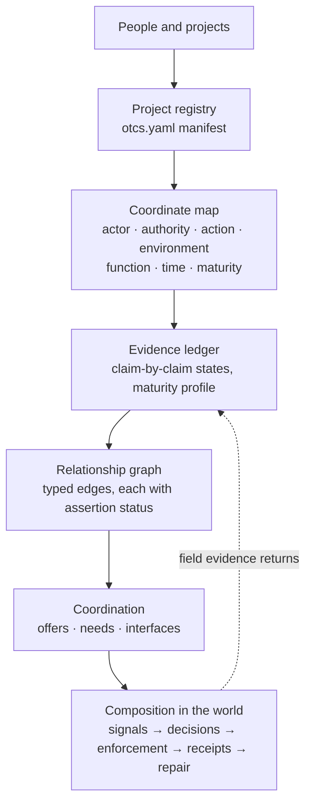
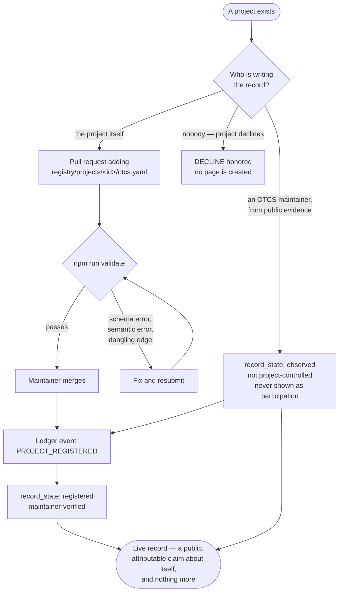
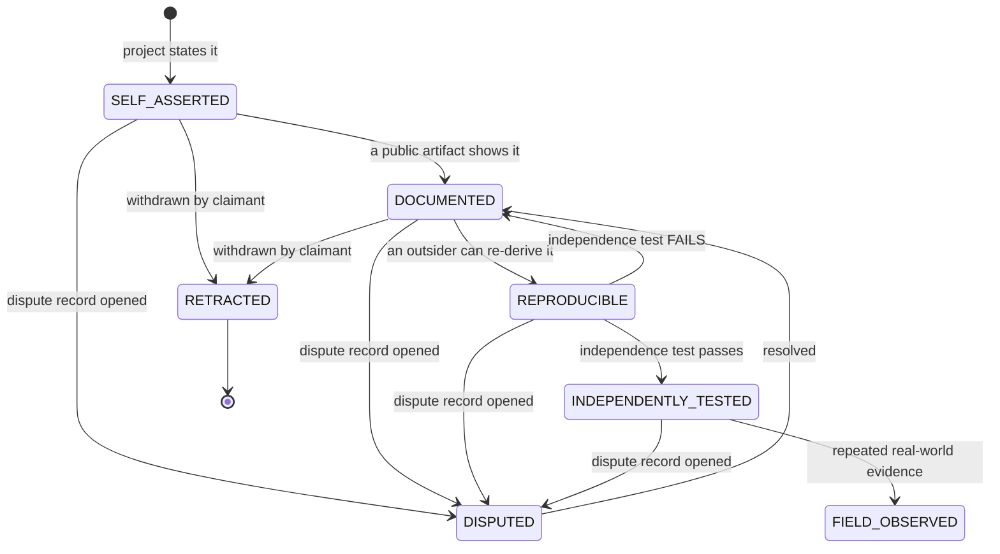
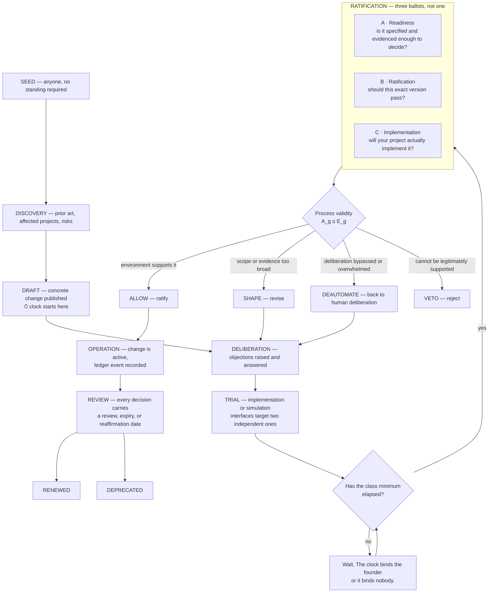
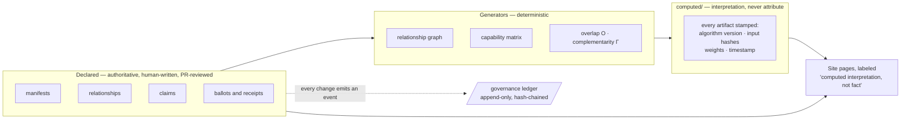

# How OTCS works — the process

*Five diagrams. The first is the whole system; the rest are the four flows that make it run.*

---

## 1. The system, end to end

A project describes itself, gets located in shared coordinates, accumulates evidence and relationships, and becomes findable by people who need what it does. Nothing here validates anything by the fact of being listed.

The dotted line is the only way maturity ever rises to the top of the scale: real deployment, observed, reported back.

---

## 2. Getting into the registry

Self-registration is the normal path. Two other doors exist and both are visibly different from it.

Registration asserts existence. It does not imply endorsement, validation, interoperability, originality, or conformance.

---

## 3. How a claim earns its evidence state

Every claim moves on its own. A single project routinely holds claims in three different states at once — that is the expected condition, not an anomaly.

**The independence test** is the gate that matters. An evaluator is *not* independent merely for being a separate legal entity. Any of these and the evaluation lands at `DOCUMENTED` instead: shared founders · shared funders · advisory relationship · reciprocal review · employment · contractor status · code contribution · commercial dependency · substantial prior collaboration.

`RETRACTED` removes the claim's force, never the record of it.

---

## 4. How the shared system changes

Nothing changes by consensus, seniority, or volume. It changes by proposal, on a clock, through three separate questions — and a vote count alone never ratifies anything.

**Clocks by consequence:** typo 24–72h · registry update 3–7d · interface clarification 7–14d · new interface 21–30d · breaking change 30–45d · constitutional or model revision 45–90d · emergency immediate but auto-expiring in 7 days.

**The gate is the point.** A proposal with 80% support is *held*, not ratified, if affected projects were absent, a serious objection went unanswered, notification failed, the version changed mid-vote, or the participant set was organizationally concentrated.

---

## 5. Declared facts vs computed interpretations

The separation that keeps a score from turning into a reputation.

Overlap says two projects occupy similar positions. It says nothing about copying — derivation needs chronology, documented access, distinctive terminology, structural correspondence, citations, transmission paths. High overlap with no transmission evidence is **independent convergence**, which strengthens both records.

And the ledger's honest limit, stated wherever it appears: this is **tamper-evident sequence integrity**, not immutable evidence. The chain proves the committed records form a consistent sequence. It cannot prove that omitted events never existed, that timestamps are true, that the author held authority, or that any event's content is factually correct.

---

## The rule underneath all five

> A system that cannot show its own weakness in the same format it demands of everyone else is not a registry. It is a brochure.

Which is why KTP is registered as project #1 with a zero in its validation column, why OTCS scores itself on its own scale, why the unreachable rung is named on the capability matrix, and why the proposal adopting this registry is sitting unfinished with its clock still running.
